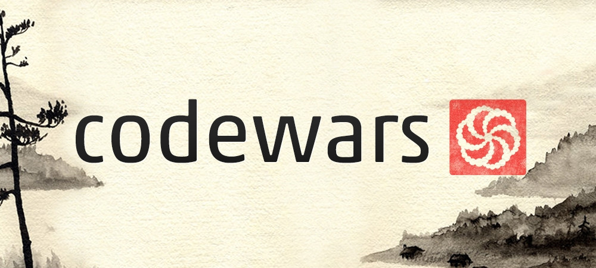

### Codewars Problems

#### 7 kyu
**Algorithms**  
- `Only one`

___

#### 8 kyu  
**Algorithms**  
- `What is between`  
- `Count the Monkeys`  

**Arrays**
- `A Needle in the Haystack`  
- `Array plus array`
- `Find the first non-consecutive number` 
- `My head is at the wrong end`  
- `Sum Mixed Array`  

**Debugging**  
- `Basic variable assignment`  
- `Get Planet Name By ID`  
- `Incorrect division method`
- `Return to Sanity`

**Fundamentals**  
- `Alternating case`  
- `Difference of Volumes of Cuboids`  
- `Function 2 squaring an argument`   
- `Grasshoper - Debug sayHello`  
- `Hex to Decimal`  
- `Is it even`  
- `Is it a palindrome`  
- `Keep up the hoop`  
- `Parse nice int from char problem`  
- `Rock Paper Scissors`  
- `Student's Final Grade`  
- `Sum The Strings`  
- `Sum without highest and lowest number`  
- `Super Duper Easy`  
- `Switch it Up`  
- `Thinkful Logic Drills Traffic light`  
- `Third Angle of a Triangle`  
- `Transportation on vacation`  

**Lists**  
- `Flick Swich`  

**Logic**
- `L1 Set Alarm`  

**Mathematics**  
- `Powers of 2`

**OOP**  
- `Classy Classes`

**Strings**  
- `DNA to RNA Conversion`  
- `Do I get bonus`  
- `If you can't sleep, just count sheep`  
- `Is the string uppercase`  
- `Remove exclamation marks`  
